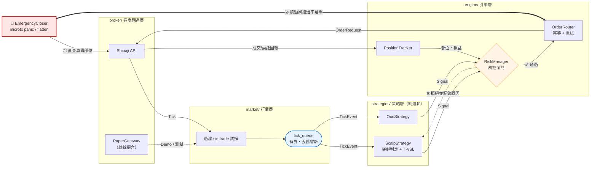

# Shioaji-MicroTX-Engine

[](https://github.com/slate-re/Shioaji-MicroTX-Engine/actions/workflows/ci.yml)
[](https://www.python.org/)
[](https://github.com/astral-sh/ruff)
[](LICENSE)
[]()

> 台指期（微台 TMF / 小台 MXF / 大台 TXF）**當沖自動條件單引擎**
> 基於永豐金證券 [Shioaji API](https://sinotrade.github.io/zh/)，以多執行緒事件驅動架構實作。

---

## 為什麼有這個專案

Shioaji **原生沒有條件單 API**。官方文件提供的 `TouchOrder` 只有 20 行範例，
用 `price == touch_price` 做精確相等比對——**跳空時永遠不會觸發**，也沒有出場、
沒有風控、沒有執行緒安全保護，無法直接上線。

本專案把那 20 行範例補成一套可長期運行的當沖引擎：

| 官方範例的問題 | 本專案的解法 |
|---|---|
| `price == trigger` 精確比對，跳空失效 | **穿越判定**：多單 `price >= trigger`、空單 `price <= trigger` |
| 未過濾試撮價 `simtrade` | 行情層第一道過濾，杜絕盤前假價格誤觸發 |
| `flag` 布林旗標非執行緒安全 | `threading.Lock` + 冪等狀態機 |
| callback 內直接 `place_order` 阻塞行情執行緒 | callback 只推事件進佇列，worker thread 負責下單 |
| 無出場、無風控、無收盤處理 | 停利停損、單日停損停機、部位上限、13:40 強制平倉 |
| 假設「委託回報先於成交回報」 | 狀態機容忍成交回報先到（交易所實際行為） |

---

## 快速開始

**免帳號、免網路、不需安裝券商 SDK**，三步驟看到完整交易生命週期：

```bash
git clone https://github.com/slate-re/Shioaji-MicroTX-Engine.git
cd Shioaji-MicroTX-Engine
python3 -m venv .venv && source .venv/bin/activate
pip install -e ".[dev]"

microtx demo      # 重播行情，走完觸價 → 進場 → 停利 → 平倉
pytest            # 385 個單元測試
```

要連線永豐（模擬或實盤）時才需要：

```bash
pip install -e ".[dev,live]"     # 加裝 shioaji SDK
cp .env.example .env             # 填入 API Key，SIMULATION 保持 true
chmod 600 .env
```

> 🔒 預設 `SIMULATION=true`。實盤需 `SIMULATION=false` **且** `ALLOW_LIVE_TRADING=true`
> 兩道開關同時打開，並提供有效憑證 —— 缺一即拒絕啟動。

---

## 常用指令

```bash
# 觸價單：突破 46500 做多，停利 +50 點、停損 -30 點
microtx run --strategy scalp --direction long --trigger 46500 --tp 50 --sl 30

# 改用絕對價位（跳空成交時停損不會跟著滑走）
microtx run --strategy scalp --direction long --trigger 46500 \
    --tp-price 46600 --sl-price 46400

# OCO 括號單：突破 46500 做多 / 跌破 46300 做空，先到先做
microtx run --strategy oco --upper 46500 --lower 46300 --tp 50 --sl 30

microtx status     # 引擎健康狀態
microtx watch      # 唯讀監看畫面（獨立行程，需 pip install -e ".[tui]"）

# 🚨 緊急處置（另開終端機或 SSH）
microtx flatten    # 刪單 + 平倉，引擎待命
microtx panic      # 刪單 + 平倉 + 引擎停機
```

進場、停利、停損可各自選擇 `--entry-order` / `--tp-order` / `--sl-order`
（`market` 或 `limit`），詳見 [`docs/operations.md`](docs/operations.md) 的委託意圖對照表。

---

## 核心設計



三個關鍵設計，圖上都看得到：

1. **行情 callback 只做過濾與入佇列** —— 佇列有界且丟舊留新，行情執行緒永不阻塞
2. **策略層只吐 `Signal`，不下單** —— 因此無 I/O、無執行緒，可 100% 單元測試與離線重播
3. **緊急平倉走粗線那條路** —— 直接向券商查部位、**繞過** `RiskManager`

> 完整分層職責、介面契約與執行緒模型見 [`docs/architecture.md`](docs/architecture.md)。

### 為什麼不預先掛限價單

若現價 46300 就掛 46500 的買單，交易所會**立刻以 46300 成交** ——
你想在突破時追多，結果變成在低點就買進，條件完全沒被驗證。

本引擎改為「監控行情 → 價格真正觸及 46500 → 才送出委託」。

---

## 🚨 立即平倉（Kill Switch）

引擎無頭常駐時，另開終端機（或 SSH 進去）即可觸發：

```bash
microtx panic      # 刪單 → 平倉 → 引擎停機，需人工重啟
microtx flatten    # 刪單 → 平倉 → 引擎繼續待命
```

三個關鍵設計，都是為了「**引擎自己出問題時這個開關仍然有效**」：

1. **部位向券商重新查詢**，不信任引擎內部狀態 —— 狀態機卡死或不同步時照樣平得掉
2. **先刪單、再平倉** —— 順序反了的話，平倉後殘留的進場單成交會讓你從空手變成反向持倉
3. **繞過 RiskManager** —— 風控的「單日虧損停機」在緊急時會擋下救命的平倉單，
   「因為虧太多所以不准你停損」是致命反模式

CLI 透過 PID 檔送 `SIGUSR1` / `SIGUSR2`；訊號處理器只設一個 `Event`，真正的平倉由
常駐的 `EmergencyWorker` 執行緒完成。13:40 強制平倉、單日停損停機、未預期例外
共用同一個 `EmergencyCloser.execute()` —— 入口多個，核心邏輯只有一份。

流程與邊界情境見 [`docs/specs/06-emergency-close.md`](docs/specs/06-emergency-close.md)。

### 哪些選擇可以開放，哪些不行

界線在**「這個東西壞掉時誰來救」**。

| 路徑 | 可否選限價 |
|---|---|
| 進場 / 停利 / 停損 | ✅ 調錯了還有強平與 `panic` 兜底 |
| 13:40 強制平倉 | ❌ |
| `panic` / `flatten` | ❌ |

強平與 `panic` 本身就是最後一道 —— 後面沒有東西接住了。
即使三條腿全設 `LIMIT`，它們送出的仍是市價委託。

---

## 風控

- 單日最大虧損達標 → 引擎進入 `HALTED`，只准平倉不准開新倉
- 單日累計損益與交易次數**跨重啟持久化** —— 崩潰重啟不會讓停損上限歸零
- 同時最大持倉口數、單日最大交易次數、下單節流
- **13:40 強制平倉**（日盤 13:45 收盤，預留 5 分鐘滑價餘裕）
- 每 60 秒比對券商實際部位與引擎內部狀態，不一致即告警

---

## 長期運行

引擎設計為無人值守常駐，附 `launchd` 設定與健康檢查腳本：

- **崩潰自動重啟**，正常退出（如手動 `panic`）則不重啟
- **`healthcheck.sh` 以四種退出碼區分**：正常 / 未運行 / 無回應 / 卡在共用鎖 ——
  PID 存活不代表引擎健康，靠 `status.json` 的新鮮度才分辨得出「活著但卡死」
- **SSH 進去就能 `microtx panic`**，人不在電腦前也能止損

安裝步驟與踩坑筆記見 [`docs/deployment.md`](docs/deployment.md)。

### 平台支援

| 功能 | macOS / Linux | Windows |
|---|---|---|
| `microtx demo`、單元測試 | ✅ | ✅ |
| 引擎常駐、`panic` / `flatten` | ✅ | ❌ |

Kill switch 依賴 Unix 訊號（`SIGUSR1` / `SIGUSR2`），Windows 的 Python 沒有這兩個訊號。

---

## 出問題的時候

```bash
tail -f logs/microtx.log                          # 即時跟看
grep -E "WARNING|ERROR|CRITICAL" logs/microtx.log # 只看要緊的
```

| 症狀 | 處置 |
|---|---|
| `Sign data is timeout` | 系統時間沒同步：`sudo systemsetup -setusingnetworktime on` |
| `status` 說「卡在共用鎖上」（退出碼 3） | 立即 `microtx panic` —— 緊急平倉會以無鎖模式強制執行 |
| `status` 說「引擎無回應」（退出碼 2） | 行程僵住 → 先 `panic`，無效再 `kill -9` 並到下單軟體確認部位 |
| 啟動後直接 `HALTED` | 多半是 `daily_state.json` 損毀，風控狀態未知 |

完整排查（登入、執行、交易三類）見 [`docs/operations.md`](docs/operations.md)。

日誌每日午夜輪替、保留 30 天，且經 `SecretMaskingFilter` 遮蔽金鑰 —— 可以安全貼出求助。

> ⚠️ 任何情況下，**只要不確定部位狀態，就先到永豐下單軟體確認並手動平倉**。
> 程式的問題可以慢慢查，裸露的部位不行。

---

## 專案結構

```
src/microtx/
├── broker/       券商閘道層（唯一 import shioaji 的地方；含免帳號的 PaperGateway）
├── market/       行情層（simtrade 過濾 + 有界佇列）
├── strategies/   策略層（純邏輯，零 I/O）
├── engine/       風控 / 下單路由 / 部位 / 排程 / 緊急平倉 / 主協調器
├── cli/          run · status · watch · panic · flatten · demo
├── tui/          唯讀監看介面（獨立行程）
└── utils/        日誌（機密遮蔽）· PID 檔 · 重試

tests/            385 個單元測試（核心模組覆蓋率 94%，不含需 SDK 的 gateway）
docs/             架構總綱 · Shioaji 速查 · 部署 · 運維 · 分模組規格
scripts/          launchd plist · 安裝 · 健康檢查
```

---

## 安全設計

| 面向 | 措施 |
|---|---|
| 金鑰管理 | 全部由環境變數注入，程式碼零硬編碼；`SecretStr` 讓 `repr()` 自動遮蔽 |
| 版控隔離 | `.gitignore` 排除 `.env`、`*.pfx`、`*.log`、`logs/`、`runtime/` |
| 提交攔截 | pre-commit + gitleaks + `detect-private-key` |
| 日誌保護 | `SecretMaskingFilter` 攔截疑似金鑰字串，寫檔前遮蔽 |
| 實盤防呆 | 需 `SIMULATION=false` **且** `ALLOW_LIVE_TRADING=true`，並驗證憑證存在 |
| 委託保護 | 強平與緊急平倉固定 `MKP + IOC`，兼顧「必成交」與「滑價可控」 |

---

## 開發

```bash
ruff format --check src tests && ruff check src tests   # 格式與 Lint
mypy src                                                # 型別檢查（strict）
pytest --cov=microtx                                    # 測試與覆蓋率
pre-commit run --all-files                              # 含 gitleaks 機密掃描
```

- 全面 Type Hints，`mypy --strict` 零錯誤
- 註解與 docstring 使用繁體中文
- CI 在 Python 3.10 / 3.11 雙版本執行，且**刻意不安裝 `live` extra** ——
  持續驗證「未安裝券商 SDK 時全套測試與 Demo 仍可運行」

---

## ⚠️ 免責聲明

本專案為**個人技術作品集（Portfolio）**，用於展示 Python 工程能力、
API 整合、狀態機設計與軟體工程實務，**不構成任何投資建議**。

- 期貨為**高槓桿商品**，可能在極短時間內造成超過本金的損失。
- 程式交易存在**軟體缺陷、網路延遲、行情中斷、API 變更、憑證失效**等風險，
  自動化並不降低市場風險，反而可能因失控而放大損失。
- 本引擎的停損是**應用層**的，不是掛在券商端的條件單 ——
  引擎未運行時（斷電、斷網、程式崩潰）**停損不會執行**。
- 模擬環境的成交為模擬撮合，**與實盤成交結果必然存在差異**，
  模擬獲利不代表實盤可複製。
- 使用本程式進行任何真實交易所產生的**一切盈虧與法律責任，概由使用者自行承擔**，
  作者不負任何擔保或賠償責任。
- 強烈建議：先在模擬環境長期驗證，實盤請從**最小口數（微台 1 口）**開始。

**在你完整讀懂每一行程式碼之前，請勿用於實盤。**

---

## 延伸文件

- [架構總綱：分層、介面契約、執行緒模型](docs/architecture.md)
- [Shioaji API 在地化速查](docs/shioaji_guide.md)
- [無人值守部署與 launchd 設定](docs/deployment.md)
- [運維手冊：狀態對照、日誌、疑難排解](docs/operations.md)
- [分模組實作規格](docs/specs/00-roadmap.md)

## 授權

[MIT License](LICENSE)
